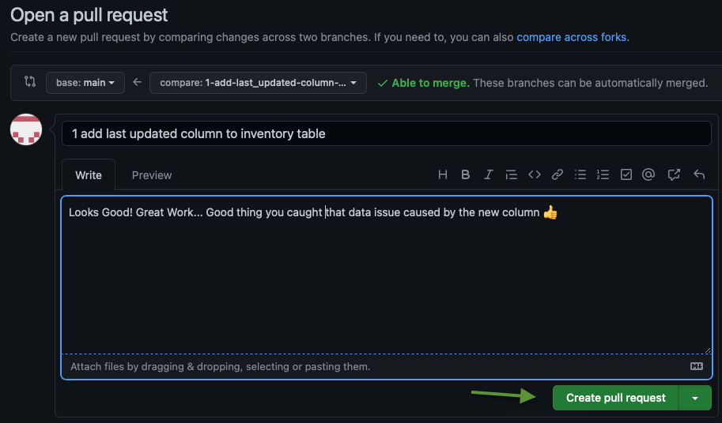
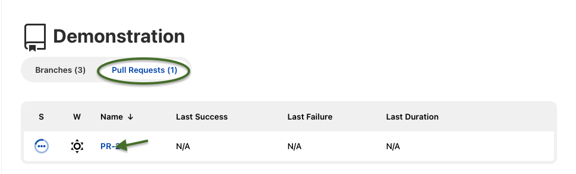

# Schema CI/CD - Jenkins

At this stage, you should have a Jenkins Multibranch Pipeline integrated with your GitHub repository for Schema CI/CD.  This demonstration will walk through a typical schema change request workflow using Liquibase with SQLcl.

_**A brief note:**_ This demonstration creates an isolated development environment in a different schema on the same database.  This is to reduce the infrastructure required to run the demo.  Using a different database (incl. OCI Autonomous Database), a different PDB, a Sparse Clone, etc. are interchangeable solutions to the isolated schema approach.  

## Overall Demonstration Process


### Step **1**: New Issue is Raised

A new issue is created in your GitHub repository to track the lifecycle of the change.  This is often a bug report, new feature, or enhancement request.

### Step **2**: Issue is Assigned and Branch Created

A DBA/Developer is assigned to the issue.  They create a new "feature" branch, as a copy of the main branch, to work on the issue.  The creation of the "feature" branch will trigger a new build in Jenkins.  

The Jenkins build will create a new schema using Liquibase and code from GitHub.  This allows for work on the issue to be in an isolated environment to develop and test any changes.

### Step **3**: Development Workflow

The DBA/Developer will work on the issue in the newly created isolated schema.  Depending on their preference, this can be done directly in the database or directly in the Liquibase code.  Once the developer is happy with the changes, they commit and push them to the remote "feature" branch.

The push will trigger a new build in Jenkins.  The build will integrate the new code into their schema using Liquibase.  Any additional tests, linting, etc. can be run during this build.  This process continues until the developer is satisfied with the changes.

### Step **4**: Review and Merge

When the developer has completed all of the work on the issue, they will open a Pull Request for approval to merge the changes into the main branch for releasing.  The Pull Request will trigger another build in Jenkins that will tear down their "feature" branch isolated environment (schema); it can also run any additional automated tests required.

If the tear down and additional automated tests succeed, the "Pull Requests" is approved and the changes are merged into the main branch for release.

## Demonstration Steps

### Step **1**: Hands-On - New Issue is Raised

1. Log into GitHub and click on the repository which has been integrated with Jenkins.
2. Create a New Issue
    - If you do not see the Issue tab, click on "Settings" and scroll down to "Issues"; check the box.

    - **Title:** Add LAST_UPDATED Column to Inventory Table
    - **Write:** Add a new column to the inventory table to track the last time the inventory was updated.
    - Submit Issue
    

### Step **2**: Hands-On - Issue is Assigned and Branch Created

1. If not already on the New Issue, navigate to "Issues" and click on the issue you just created.
2. Assign the issue to yourself and click on "Create a Branch"

3. On the Pop-Up: Leave Defaults and "Create Branch"  


#### **Feature Build Pipeline**

On the Jenkins Controller, a new build will have been initiated by the creation of the branch.  This build will create the isolated development environment to work on the issue in.

1. Click on "Demonstration"

2. Click on the "Feature" branch (1-add-last...)

3. Click on "Last Build #1..."

4. Click Console Output


The Console Output will show that Liquibase created the schema `INVENTORY1`, created the `INVENTORY1.INVENTORY` table, and loaded static data into the table.

### Step **3**: Hands-On - Development Workflow

In the OCI Console, Navigate to the Autonomous Database and click on `Database Actions > SQL`.

Add the new column and run:

```sql
ALTER TABLE INVENTORY1.INVENTORY ADD LAST_UPDATED TIMESTAMP;
```


#### **Export Schema Changes**

In Cloud Shell, navigate to your repositories liquibase directory.  This directory contains the Liquibase ChangeSets which define the "Production" schema.  

Ensure you are in the git "feature" branch for your change:

```bash
$ git fetch

remote: Enumerating objects: 32, done.
remote: Counting objects: 100% (32/32), done.
remote: Compressing objects: 100% (30/30), done.
remote: Total 30 (delta 20), reused 0 (delta 0), pack-reused 0
Unpacking objects: 100% (30/30), 6.76 KiB | 576.00 KiB/s, done.
From https://github.com/gotsysdba/oci-liquibase-jenkins-clone
 * [new branch]      1-add-last_updated-column-to-inventory-table -> origin/1-add-last_updated-column-to-inventory-table


$ git checkout 1-add-last_updated-column-to-inventory-table

Branch '1-add-last_updated-column-to-inventory-table' set up to track remote branch '1-add-last_updated-column-to-inventory-table' from 'origin'.
Switched to a new branch '1-add-last_updated-column-to-inventory-table'


$ git branch

* 1-add-last_updated-column-to-inventory-table
  main
```

Export the change made in the INVENTORY1 schema into the liquidbase directory of your repository:

```bash
$ cd liquidbase
$ sql /nolog
SQL> set cloudconfig ../wallet/JENKINSDB_wallet.zip
SQL> connect INVENTORY1/<password>@JENKINSDB_HIGH
SQL> lb genschema -split
SQL> exit
```

After exporting, one file would have changed which will represent the change to the schema:

```bash
$ git status
On branch 1-add-last_updated-column-to-inventory-table
Your branch is up to date with 'origin/1-add-last_updated-column-to-inventory-table'.

Changes not staged for commit:
  (use "git add <file>..." to update what will be committed)
  (use "git restore <file>..." to discard changes in working directory)

        modified:   table/inventory_table.xml <-- This file has been modified

no changes added to commit (use "git add" and/or "git commit -a")
```

#### **Commit Changes To Version Control**

Depending on how you cloned your repository to Cloud Shell, you may need to generate a Personal Access Token (PAT).  If the below `git push` command prompts for a username/password, please follow [these instructions](https://docs.github.com/en/authentication/keeping-your-account-and-data-secure/creating-a-personal-access-token) to generate a PAT for authentication, ticking "repo" for scope.

```bash
$ git add .
$ git commit -m "Added LAST_UPDATED Column to Inventory Table"
$ git push

Username for 'https://github.com': git
Password for 'https://git@github.com': <PAT Token>
Enumerating objects: 9, done.
Counting objects: 100% (9/9), done.
Delta compression using up to 2 threads
Compressing objects: 100% (4/4), done.
Writing objects: 100% (5/5), 571 bytes | 571.00 KiB/s, done.
Total 5 (delta 3), reused 0 (delta 0), pack-reused 0
remote: Resolving deltas: 100% (3/3), completed with 3 local objects.
```

### Step **4**: Hands-On - Review and Merge

Back in GitHub, a notification that your "feature" branch has had recent pushes with the option to "Compare & pull request"

1. Click "Compare & pull request"

2. The next screen will show the changes you made to the "feature" branch.  Notice the new column that was created in the `INVENTORY1.INVENTORY` table

3. Change the base branch to your repositories "main", and click "Create pull request"


#### **Pull Request Pipeline**

On the Jenkins Controller, a new build will have been initiated by the Pull Request (PR). This build will drop the isolated development environment.

1. Select the "Pull Request" Tab and Click on the "Name of the PR"

2. Click on "Last Build #1..."
3. Click Console Output to review the output.

You can verify the INVENTORY1 schema was dropped from the Autonomous Database.  In the OCI Console, Navigate to the Autonomous Database and click on `Database Actions > SQL`:

```sql
SELECT COUNT(*) FROM DBA_USERS WHERE USERNAME='INVENTORY1';
```

### **Merge the Change into Main**

1. In GitHub, Select the Pull Request you just created.

2. Merge the Pull Request

3. Click "Confirm merge"
4. Your "feature" branch change is now in the "main" branch.  The "feature" branch can be deleted.


#### **Main Branch Pipeline**

On the Jenkins Controller, a new build will have been initiated by the Merge. This build will implement the change (new LAST_UPDATED column) in the "Production" INVENTORY schema.
